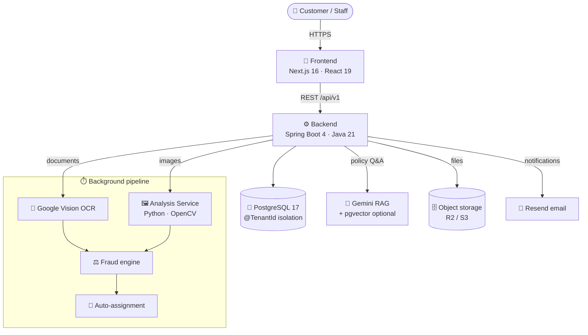

<div align="center">

# 🛡️ ClaimLens

### Settle honest claims faster. Catch the ones that aren't.

A multi-tenant SaaS where a customer files a motor-insurance claim, documents are read by OCR, photos are checked for fraud, a rules engine scores the risk, an investigator is assigned, and the claim is approved or rejected — **with strict tenant isolation and a complete audit trail.**

`Spring Boot 4` · `Java 21` · `PostgreSQL 17` · `Next.js 16` · `React 19` · `Google Vision` · `Gemini RAG`

</div>

---

## 📖 Table of contents

- [🎯 The problem & the idea](#-the-problem--the-idea)
- [✨ What it does](#-what-it-does)
- [🏗️ Architecture](#️-architecture)
- [🧱 Tech stack](#-tech-stack)
- [🔄 How a claim flows (example)](#-how-a-claim-flows-example)
- [🔐 Security model](#-security-model)
- [🤖 The intelligence layer](#-the-intelligence-layer)
- [👥 Roles & demo logins](#-roles--demo-logins)
- [🚀 Quick start](#-quick-start)
- [📁 Project structure](#-project-structure)
- [🧪 Testing](#-testing)
- [🗺️ Roadmap](#️-roadmap)
- [👨‍💻 Author](#-author)

---

## 🎯 The problem & the idea

Insurance claims live in a permanent tension between **speed** and **caution**:

- 🙂 The **policyholder** wants their genuine claim settled quickly and fairly.
- 🏢 The **insurer** wants to pay every valid claim, catch the fraudulent ones, and keep an audit trail for the regulator.

Lean too far toward *speed* and you leak money to fraud. Lean too far toward *caution* and you punish honest customers and bury investigators in paperwork.

**ClaimLens resolves this tension with software:** read the documents automatically, surface only the claims that actually look suspicious, and record *why* every decision was made — so the same team handles far more volume without cutting corners. A human still owns every real decision; the platform just does the mechanical part.

---

## ✨ What it does

<table>
<tr>
<td width="50%" valign="top">

**🏢 Multi-tenant by design**
Every insurer is a fully isolated tenant — enforced in the **database**, not by convention. Two tenants can never see each other's data.

**📸 OCR document intake**
RC books, FIRs, repair estimates and invoices are read automatically (Google Cloud Vision), with registration & policy numbers extracted.

**🕵️ Image fraud forensics**
Perceptual-hash **duplicate detection**, **ORB** similarity, three-state **EXIF** checks, and a **synthetic-image** signal — catches reused and tampered damage photos.

**⚖️ Explainable fraud engine**
A config-driven rules engine scores every claim and shows **exactly why** — because an automated decision must be auditable.

</td>
<td width="50%" valign="top">

**🤖 AI policy intelligence (RAG)**
Ask coverage questions in plain language and get answers grounded in the **actual policy wording**, with citations back to the clauses.

**🙋 Customer self-service portal**
Policyholders file, upload, submit and track their own claims — with ownership scoping *below* the tenant, so one customer can never see another's claim.

**📊 Platform console**
A cross-tenant operator view: platform-wide analytics, tenant lifecycle, and impersonation.

**📝 Full lifecycle & audit**
Three-step intake → auto-assignment → investigation → decision, with document versioning and an append-only audit trail. **Two-way information requests**: an investigator asks for a document, the customer uploads it from the portal, and the claim re-opens and reprocesses itself.

**🔑 Self-service credentials**
New users are **invited**, not handed a password — a single-use, expiring link lets them set their own, so an admin never knows anyone else's credential. Same machinery powers password reset.

**📧 Rich claim reports**
Every claim email is branded HTML with an attached **PDF report** — key stats, the incident description, the decision and who made it, and the customer's uploaded photos **embedded in the PDF**.

</td>
</tr>
</table>

---

## 🏗️ Architecture



**Key design choices**

- 🔒 **Tenancy is a database concern.** Every tenant-scoped entity carries a Hibernate `@TenantId` discriminator that's appended to *every* query — including load-by-id — and set automatically on insert. You can't forget it.
- 🔌 **Swappable clients everywhere.** OCR, image analysis, embeddings, chat, email and storage each sit behind an interface with a **no-op/offline default** and a **real** implementation toggled by config — so tests and offline runs stay green, and real integrations slot in without code changes.
- 🧩 **Best-effort by default.** A document that fails, a service that's down, an AI key that's throttled — none of it hangs a claim. The pipeline settles on *terminal* state (succeeded **or** retries-exhausted), and AI degrades to an offline answer.
- 📖 **Explainability is a feature.** Every fraud score keeps its per-rule breakdown; every RAG answer keeps its citations; every state change is audited.

---

## 🧱 Tech stack

| Layer | Technology |
|-------|-----------|
| **Backend** | Java 21, Spring Boot 4, Spring Security (JWT), Spring Data JPA / Hibernate 7 |
| **Database** | PostgreSQL 17, HikariCP pool, Flyway migrations, optional `pgvector` (HNSW) |
| **Cache** | Spring cache abstraction — Caffeine (dev) / Redis · Upstash (prod), same code |
| **Frontend** | Next.js 16 (App Router), React 19, TypeScript, Tailwind CSS 4, shadcn/ui, Redux Toolkit, axios |
| **OCR** | Google Cloud Vision (swappable with Tesseract) |
| **Image analysis** | Python · FastAPI · OpenCV · imagehash · Pillow |
| **AI / RAG** | Google Gemini (embeddings + chat), in-Java cosine or pgvector retrieval |
| **Storage / Email** | Cloudflare R2 (S3-compatible) · Resend |
| **Infra** | Docker (multi-stage) · Render · Vercel · Neon · Upstash |

---

## 🔄 How a claim flows (example)

Here's the end-to-end journey of a real claim 👇

```
1. 🙋 Rahul (customer) logs into the portal and files a claim on his policy DEMO-POL-1.
      POST /api/v1/portal/claims  →  status: DRAFT

2. 📎 He uploads a photo of the damaged windshield.
      POST /api/v1/portal/claims/{id}/documents

3. ✅ He submits. Hard validations run (policy active on the loss date? vehicle covered?
      claimant = policyholder?).
      POST /api/v1/portal/claims/{id}/submit  →  status: AWAITING_ANALYSIS

4. ⚙️ In the background:
      🔎 OCR reads "MH12AB1234" and the policy number off the document.
      🖼️ Image analysis fingerprints the photo (perceptual hash) + checks EXIF.
      ⚖️ The fraud engine scores the claim and explains each rule → risk: LOW.
      →  status: AWAITING_ASSIGNMENT

5. 🕵️ The Investigation Manager assigns it to an investigator.
      POST /api/v1/claims/{id}/assign  →  status: UNDER_INVESTIGATION

6. 🔍 The investigator reviews the evidence and approves.
      POST /api/v1/claims/{id}/decision  →  status: APPROVED

7. 📧 Rahul gets an email: "Your claim has been approved." — and the whole path is audited.
```

> 💡 A `TENANT_ADMIN` sees it all; the `CUSTOMER` only ever sees **their own** claim; a rival tenant sees a **404**. That boundary is enforced in the database and tested as a hard gate.

---

## 🔐 Security model

**Two independent boundaries, both enforced server-side:**

1. **🏢 Tenant isolation** — Hibernate `@TenantId` scopes every query to the caller's tenant. A cross-tenant read isn't a `403` (which would confirm the record exists) — it's a **`404`**. Proven by a dedicated isolation test suite.

2. **🙋 Ownership (customer portal)** — because two customers share a tenant, `@TenantId` alone doesn't separate them. The portal adds a second gate: every read/write is scoped to the authenticated customer via `findByIdAndCustomerId(...)`, with the customer id coming from the JWT — never the request body.

**Role-based access control** — permissions are checked with `@PreAuthorize` on the **service** layer (not the UI). The JWT carries only a **role id**, never a permissions array, so a signed token can never hold stale authority — permissions are resolved server-side from the database. That resolution runs on every authenticated request, so it's **cached** (Caffeine in dev, Redis in prod) with a short TTL; role→permission mappings are migration-managed, so a change is a redeploy, which clears the cache. The frontend hides buttons a role can't use; the backend enforces the rule regardless.

**Brute-force protection** — sign-in is rate limited per client IP, and the cost-bearing endpoints (AI answers, document uploads) per user. Backed by Redis in production so the limit holds across instances, and it **fails open**: if the limiter is unreachable the request is allowed, because a throttle outage must never become a login outage.

```java
// Real enforcement lives here, not in the client:
@PreAuthorize("hasAuthority('CLAIM_DECIDE')")
public ClaimResponse decide(Long claimId, ClaimDecisionRequest request) { … }
```

---

## 🤖 The intelligence layer

**🔎 OCR — documents into data.** Vision reads the pixels back into text; permissive regexes then extract registration numbers, policy numbers and amounts. OCR output is a *signal*, never ground truth — it's cross-checked against the policy on record.

**🖼️ Image forensics — cheap signals, honest limits.**
- **Perceptual hashing** catches a damage photo reused across claims (the #1 motor-fraud pattern).
- **ORB feature matching** catches lightly-edited reuse that hashing misses.
- **EXIF** is three-state: only a genuine *inconsistency* (capture time before the incident) counts — **missing metadata is never suspicion** (social apps strip it).
- **Synthetic-image** detection is always a soft signal, never an auto-reject.

**🧠 RAG — answers from the policy itself.** "Is windshield damage covered?" is answered from *this policy's* wording, with citations — and scoped to the claim's **pinned** version, so the answer reflects the terms the customer actually contracted under. Retrieval runs on in-Java cosine over JSON-stored embeddings by default (works on any Postgres), or **pgvector + HNSW** when enabled. If the AI provider is unavailable, it **degrades gracefully** to an offline extractive answer instead of failing.

---

## 👥 Roles & demo logins

Eight one-click demo accounts, each with a real permission set (password **`Password123!`**, sandbox only):

| Role | What they can do |
|------|------------------|
| 🏢 **Platform Admin** | Everything across every tenant; onboard/suspend tenants; impersonate |
| 👔 **Tenant Admin** | Full workspace — org, products, policies, customers, claims, users, rulesets |
| 🕵️ **Investigation Manager** | Read claims, assign to investigators, read fraud scores |
| 🔍 **Investigator** | Read claims, add notes, **decide** (approve/reject) |
| 🙋 **Customer** | File, upload, submit and track **their own** claims (portal) |
| 📞 **Customer Support** | Create & submit claims on behalf of customers |
| 🧑‍💼 **Employee (Adjuster)** | Read policies, ask coverage questions |
| 📊 **Auditor** | Analytics, audit trails, read-only org |

> 🔎 The nav, buttons and pages a user sees are driven entirely by their server-resolved permissions.

---

## 🚀 Quick start

```bash
# 1. Backend  → http://localhost:8080
cd backend && cp .env.example .env      # set DATABASE_PASSWORD + JWT_SECRET
./mvnw spring-boot:run                  # auto-loads .env, Flyway migrates + seeds demo data

# 2. Frontend → http://localhost:3000
cd frontend && npm install && npm run dev
```

Then open **http://localhost:3000** and click a demo login. 🎉

👉 **Full step-by-step guide (DB, integrations, tests, troubleshooting): [setup.md](setup.md)**
👉 **Deploy to the cloud (Render + Vercel + Neon + R2 + Resend + Vision + cron): [deploy.md](deploy.md)**

---

## 📁 Project structure

```
Claim-Lens/
├── backend/            ⚙️  Spring Boot API — auth, tenancy, claims, fraud, RAG, portal, platform
│   ├── src/main/java/…/claimlens/
│   │   ├── tenancy/     🔒 @TenantId multi-tenancy
│   │   ├── security/    🔑 JWT + RBAC
│   │   ├── claim/       📝 claim lifecycle
│   │   ├── processing/  ⏱️ OCR / analysis / fraud orchestration
│   │   ├── coverage/    🤖 RAG (embeddings, chat, pgvector)
│   │   ├── portal/      🙋 customer self-service
│   │   └── platform/    📊 cross-tenant console
│   └── src/main/resources/db/migration/   🗃️ Flyway (V1…V26)
├── frontend/           🎨  Next.js app — staff workspace, portal, platform, landing, blog, roadmap
├── analysis-service/   🖼️  Python/FastAPI image-fraud service (OpenCV)
├── ocr-service/        🔎  Python/FastAPI OCR service (Tesseract/Vision) — alt to in-JVM Vision
├── docs/               📚  design docs
├── setup.md            🛠️  local setup
└── deploy.md           ☁️  deployment
```

---

## 🧪 Testing

```bash
cd backend && ./mvnw test        # 92 integration & unit tests
```

The suite runs against real **PostgreSQL** (not H2 — the app uses JSONB, partial indexes and `TIMESTAMPTZ`), with **Flyway** re-validating every migration on each run. Highlights:

- 🔒 **Tenant isolation** — as tenant A, reading tenant B's record returns **404**, seeded via raw JDBC so the *reader* is what's proven filtered.
- 🙋 **Ownership isolation** — customer A gets **404** for customer B's claim in the same tenant.
- 🔑 **RBAC** — a revoked permission is denied on the *next* request (the cache is disabled under the test profile, so this proves the live path).
- ⚖️ **Full pipeline** — draft → submit → OCR → analysis → fraud → assign → decide.
- 🤖 **RAG** — retrieval is tenant-scoped and citations point at the right clause.
- 🚦 **Rate limiting** — repeated sign-ins get a **429**, while ordinary reads are never throttled.
- 👤 **Onboarding** — a customer login must be linked to a policyholder, and an invited account can't sign in until it sets a password.
- ⚡ **Cache resilience** — a cache failure degrades to a database read instead of failing the request.

A **240-check cross-role sweep** additionally verifies every role can do exactly what it should — and nothing it shouldn't.

---

## 🗺️ Roadmap

What's shipped and what's next lives on the in-app **`/roadmap`** page. In short:

- ✅ **Shipped:** multi-tenancy, full claim lifecycle, Google Vision OCR, image forensics, explainable fraud engine, AI policy Q&A, customer portal, platform console, document versioning, email.
- 🔜 **Next:** cloud hardening (rate limiting, metrics, structured logs), pgvector at scale, more claim types (health/property), real-time notifications, outbox event worker, claimant mobile app, richer analytics/export.

---

## 👨‍💻 Author

**Yogesh Chauhan**
🌐 [yogeshchauhan.dev](https://yogeshchauhan.dev) · 🐙 [GitHub](https://github.com/Yogesh0627) · 💼 [LinkedIn](https://www.linkedin.com/in/yogeshchauhan-dev/) · ✉️ chauhanyogesh950@gmail.com

<div align="center">

*Built to show that "fast" and "careful" don't have to be a trade-off.* 🛡️

</div>
